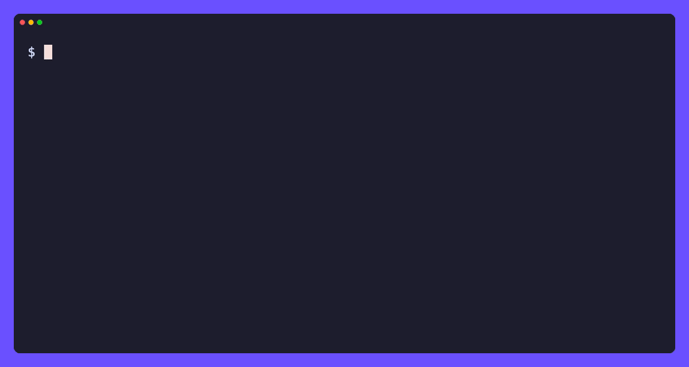

# x

[](https://github.com/tamnd/x-cli/actions/workflows/ci.yml)
[](https://github.com/tamnd/x-cli/releases/latest)
[](https://pkg.go.dev/github.com/tamnd/x-cli)
[](https://goreportcard.com/report/github.com/tamnd/x-cli)
[](./LICENSE)

A fast, friendly command line for X (Twitter). One pure-Go binary that reads
tweets, profiles, timelines, threads, and search over X's free public surfaces
and crawls accounts into a local SQLite store. Strictly read-only: it never
writes to your account. No paid API, nothing to sign up for.

[Install](#install) • [Commands](#commands) • [Output](#output) • [Session](#your-own-session) • [Guides](#guides)



Documentation: <https://x-cli.tamnd.com> (mirror: <https://tamnd.github.io/x-cli>)

```bash
x tweet 20                         # a single tweet
x user nasa                        # a profile
x timeline nasa --guest -n 20      # a user's recent tweets
x search "from:nasa filter:media" --guest -o jsonl
x download https://x.com/nasa/status/2064422103416238295 -O .
```

## How it works

x speaks only X's own free, public surfaces, the same ones a logged-out browser
uses, across three tiers. It picks the cheapest one that can answer each call:

- **Tier 0, syndication.** The public embed/syndication endpoint. No auth at
  all. Serves single tweets, profiles, and the recent timeline window.
- **Tier 1, guest GraphQL.** An opt-in (`--guest`) guest token, minted the same
  way the web client mints one. Pages deeper into timelines and resolves more.
- **Tier 2, session GraphQL.** Your own browser session cookies, imported with
  `x auth import`. Unlocks reads X reserves for logged-in clients: search,
  followers/following, your home timeline, and bookmarks.

There is no developer API key and no paid plan anywhere in the tool, and the
tool only ever reads. It has no commands that post, like, follow, or otherwise
change your account.

## Install

```bash
go install github.com/tamnd/x-cli/cmd/x@latest
```

Or build from source:

```bash
git clone https://github.com/tamnd/x-cli
cd x-cli
make build        # produces ./bin/x
```

x is pure Go (`CGO_ENABLED=0`); the binary has no runtime dependencies.

Shell completion is built in: `x completion bash|zsh|fish|powershell`.

## Commands

The everyday reads. The tier column shows the cheapest tier that can answer:
Tier 0 needs nothing, `g` needs `--guest` or a session, `s` needs a session.

| Command | Reads | Tier |
| --- | --- | --- |
| `x tweet <ref>` | a single tweet | 0 |
| `x user <user>` | a profile | 0 |
| `x timeline <user>` | a user's tweets (deeper with `--guest`) | 0 |
| `x thread <ref>` | the conversation around a tweet | g |
| `x replies <user>` | a user's tweets including replies | s |
| `x media <user>` | media attached to a user's tweets | s |
| `x search <query>` | search tweets | g |
| `x counts <query>` | per-day tweet counts for a search | g |
| `x followers <user>` / `x following <user>` | the follow graph | g |
| `x likers <ref>` / `x retweeters <ref>` | who liked or retweeted | g |
| `x home` / `x bookmarks` | your home timeline, your bookmarks | s |
| `x download <ref>` | a tweet's media to disk | 0 |
| `x crawl <seed>...` | breadth-first crawl into the local store | g |
| `x db <query>` | query what you have collected | local |

`x serve` exposes every read over HTTP as NDJSON and `x mcp` exposes the same
set as MCP tools. See the [CLI reference](https://x-cli.tamnd.com/reference/cli/)
for the full surface and every flag.

## Output

Every command speaks one normalized data model and renders it the way your
pipeline wants. The default is a readable list of sections on a terminal and
JSONL when piped.

```bash
x timeline nasa --guest                  # each tweet as a section (default)
x timeline nasa --guest -o table         # aligned columns in a grid
x timeline nasa --guest -o jsonl         # one JSON object per line
x timeline nasa --guest -o csv --fields id,likes,text
x timeline nasa --guest -o url           # just the permalinks
x user nasa -o template --template '{{.username}} {{.metrics.followers}}'
```

Tweet and account IDs are always strings, so a snowflake never loses precision
in `jq` or a spreadsheet.

## Your own session

Some reads X reserves for logged-in clients (search, followers/following, your
home timeline, bookmarks). Import your session once from your browser cookies:

```bash
x auth import --auth-token <auth_token> --ct0 <ct0>
x auth status
```

Then, for example:

```bash
x search "site reliability" -n 50 -o jsonl
x followers nasa -n 100 -o csv --fields username,name,followers
x home -n 50 -o jsonl
```

Your session is used only to read. The tool has no command that posts, likes,
follows, or otherwise changes your account.

## Local store

Point any read at `--db` and it also lands in a local SQLite store, so a read
doubles as a crawl. `x crawl` walks accounts breadth-first, and `x db` queries
what you have collected.

```bash
x timeline nasa --guest -n 200 --db x.db
x crawl nasa --depth 1 --db x.db
x db stats --db x.db
x db query "select username, count(*) from tweets group by author" --db x.db
```

## Guides

The full documentation lives at [x-cli.tamnd.com](https://x-cli.tamnd.com). The
guides walk through each area in depth:

- [Reading tweets](https://x-cli.tamnd.com/guides/reading-tweets/): tweets, profiles, timelines, and threads, and which tier each needs.
- [Search and discovery](https://x-cli.tamnd.com/guides/search-and-discovery/): search, counts, the follow graph, likers, and retweeters.
- [Your session](https://x-cli.tamnd.com/guides/your-account/): import your browser cookies to unlock the session-only reads.
- [Output and pipelines](https://x-cli.tamnd.com/guides/output-and-pipelines/): the formats, `--fields`, templates, and feeding `jq`.
- [The local store](https://x-cli.tamnd.com/guides/local-store/): turn any read into a crawl and query it back with SQL.

For the complete command and flag map, see the
[CLI reference](https://x-cli.tamnd.com/reference/cli/) and
[output formats](https://x-cli.tamnd.com/reference/output/).

## License

x is derived from [nitter](https://github.com/zedeus/nitter) and is licensed
under the **GNU AGPL-3.0**. See [LICENSE](LICENSE) and [NOTICE](NOTICE).
